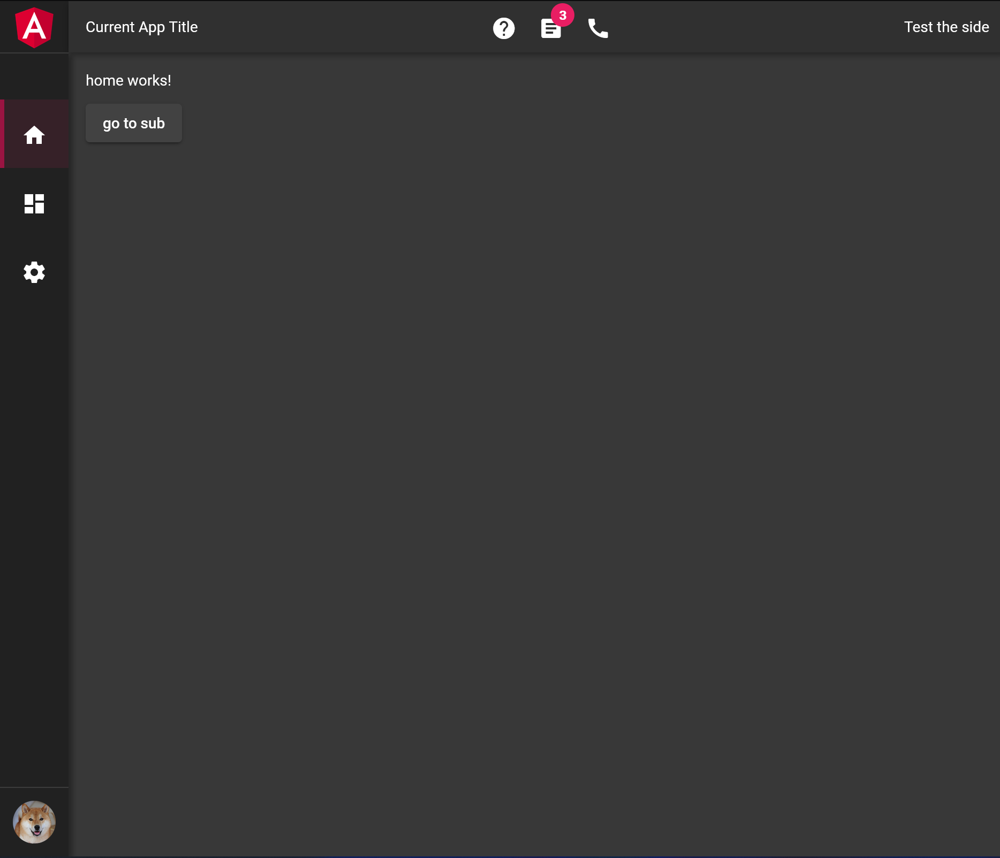
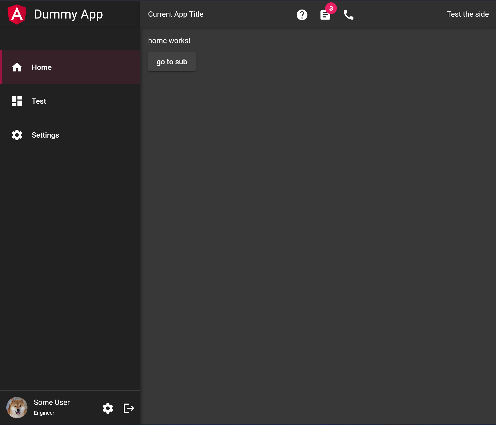

# NG UI Frame

> Note: This project is currently in a testing phase. If you are interested please feel free to contact [me](https://github.com/eksrha)

At some point there will be a documentation...

## Installation

add to your local `.npmrc` the following line to be able to use this package:
```javascript
@fullstack-devops:registry=https://npm.pkg.github.com
```

And install it:
 - yarn
 
    ```javascript
    yarn add @fullstack-devops/ng-ui-frame`
    ```
 - npm: `npm install @fullstack-devops/ng-ui-frame`

    ```javascript
    npm install @fullstack-devops/ng-ui-frame`
    ```

## Some Screenshots:



## Development server

Run `ng serve` for a dev server. Navigate to `http://localhost:4200/`. The app will automatically reload if you change any of the source files.

## Code scaffolding

Run `ng g c component-name` to generate a new component. You can also use `ng g directive|pipe|service|class|guard|interface|enum|module`.

## Build

Run `yarn run build` to build the project. The build artifacts will be stored in the `dist/` directory.

## Running unit tests

Run `yarn run test` to execute the unit tests via [Karma](https://karma-runner.github.io).

## Running end-to-end tests

Run `yarn run e2e` to execute the end-to-end tests via a platform of your choice. To use this command, you need to first add a package that implements end-to-end testing capabilities.
